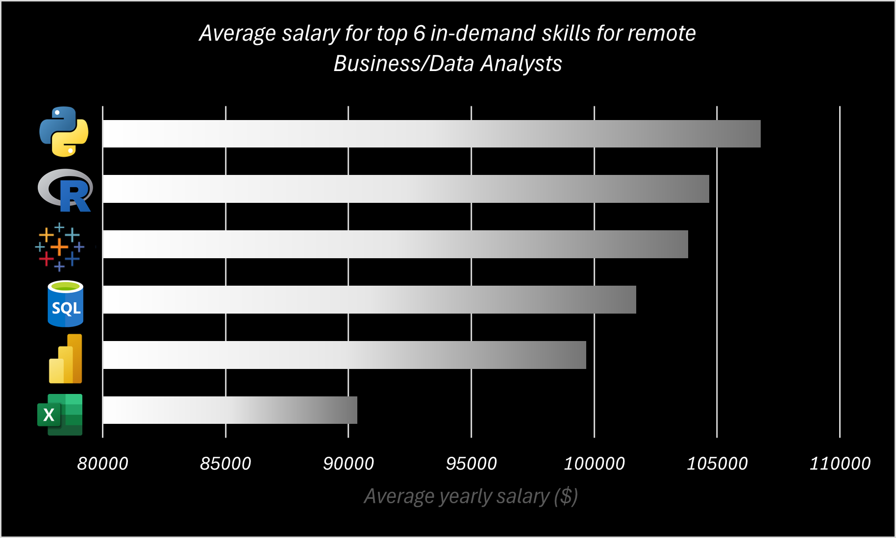

# Introduction
What would it take to work as a Business/Data Analyst, completely remotely and what would be the reward? To answer such questions I dived into a large data science job market datataset and discovered high in-demands skills, top-paying jobs and remote friendly job platforms.

All SQL queries are here: [project_sql folder](/project_sql/)

# Background

All analysis are based on a large dataset of real-world data science job postings from 2023.

### The questions I wanted to answer through my SQL queries were:

1. What are the demand and salary differences between remote and non-remote Business/Data Analyst jobs? Are the requirements higher or lower?
2. What are the most in-demand skills for remote Business/Data Analysts?
3. What are the highest paying skills for remote Business/Data Analysts?
4. Which companies are remote friendly?
5. Where to apply for remote Business/Data Analyst positions?
6. When to apply for remote Business/Data Analyst jobs?

# The tools I used

- **SQL:** Querying the database and extracting critical insights.
- **PostgreSQL:** Database management system.
- **Visual Studio Code:** Managing database and executing SQL queries.
- **Excel:** Charting and visualisation of SQL query results.
- **Git & GitHub:** Sharing my SQL scripts and analysis.

# The analysis

Each query for this project aimed at investigating specific aspects of the remote Business/Data Analyst job market. Each section contains a summary of the findings, a form of visualisation, a comment and the SQL query used to retrieve the data. Here’s how I approached each question:

### 1. What are the demand and salary differences between remote and non-remote Business/Data Analyst jobs? Are the requirements higher or lower?

Non-remote jobs dominate the market, with 1 remote job posted every 14 non-remote jobs.

| Location     | Job Published Count |
|--------------|--------------------|
| Non-Remote   | 256,573            |
| Remote       | 18,469             |


Remote jobs have a higher earning potential and a larger gap between the minimum and maximum registered salaries.
If targeting high salaries, remote roles could be worth exploring, but competition may be higher due to a global applicant pool and fewer opportunities available.

| Location    | Average Salary | Max Salary | Min Salary |
|-------------|----------------|------------|------------|
| Non-Remote  | 96,591         | 425,000    | 25,920     |
| Remote      | 98,480         | 650,000    | 16,500     |


Salary transparency is better in remote job postings, but most of them lack salary disclosure overall.

| Location    | Jobs with Salary | Jobs without Salary | Salary disclosure Ratio |
|-------------|------------------|---------------------|-------------------------|
| Non-Remote  | 6,372            | 250,201             | 2.5%                    |
| Remote      | 840              | 17,629              | 4.5%                    |


### Query used
```sql
SELECT
    CASE
        WHEN job_location = 'Anywhere' THEN 'Remote'
        ELSE 'Non-Remote'
    END AS location,
    COUNT(job_id) AS job_published_count,
    ROUND(AVG(salary_year_avg),0) AS average_salary,
    MAX (salary_year_avg) AS max_salary,
    MIN (salary_year_avg) AS min_salary,
    SUM(CASE WHEN salary_year_avg IS NOT NULL THEN 1 ELSE 0 END) AS jobs_with_salary,
    SUM(CASE WHEN salary_year_avg IS NULL THEN 1 ELSE 0 END) AS jobs_without_salary,
    ROUND((SUM(CASE WHEN salary_year_avg IS NOT NULL THEN 1 ELSE 0 END)*100.0/COUNT(job_id)),1) AS salary_info_ratio
FROM
    job_postings_fact
WHERE
    job_title_short ILIKE '%data_analyst%' OR job_title_short ILIKE '%business_analyst%'
GROUP BY
    location
```

Remote positions require on average a higher number of skills per role, which might indicate a more competitive or specialized job market or the need for more self-sufficiency. Preliminary results suggest that seekers aiming for remote roles should focus on broadening their skill set to match these requirements. This specific question will be addressed later in detail.


| Location    | Job Count | Required Skills | Avg Skills required per Job |
|-------------|-----------|-----------------|-----------------------------|
| Non-Remote  | 256,573   | 821,237         | 3.2                         |
| Remote      | 18,469    | 66,390          | 3.59                        |


### Query used
```sql
SELECT
    CASE
        WHEN job_location = 'Anywhere' THEN 'Remote'
        ELSE 'Non-Remote'
    END AS location,
    COUNT (DISTINCT job_postings_fact.job_id) AS job_count, --DISTINCT to remove duplicates from multiple skills
    COUNT (skill_id) AS required_skills,
    ROUND (COUNT (skill_id) * 1.0/NULLIF (COUNT (DISTINCT job_postings_fact.job_id), 0),2) AS avg_skills_per_job
FROM
    job_postings_fact
    LEFT JOIN skills_job_dim ON job_postings_fact.job_id = skills_job_dim.job_id
WHERE
    job_title_short ILIKE '%data_analyst%' OR job_title_short ILIKE '%business_analyst%'
GROUP BY
    location;
```

The remote job market offers a relatively higher proportion of flexible contracts, whereas the non-remote market overwhelmingly favours full-time contracts.

| Location    | Full-Time Count | Unknown Count | Non-Full-Time Count | Full-Time/Non-Full-Time Ratio |
|-------------|---------------- |---------------|---------------------|-------------------------------|
| Non-Remote  | 228,530         | 5,724         | 22,319              | 10                            |
| Remote      | 14,354          | 664           | 3,451               | 4                             |

### Query used
```sql
SELECT
    CASE
        WHEN job_location = 'Anywhere' THEN 'Remote'
        ELSE 'Non-Remote'
    END AS location,
    COUNT (job_id) AS job_count,
    COUNT (CASE WHEN job_schedule_type ILIKE '%full%time' THEN job_id END) AS full_time_count,
    COUNT (CASE WHEN job_schedule_type IS NULL THEN job_id END) AS unknown_count,
    COUNT (CASE WHEN job_schedule_type IS NOT NULL AND job_schedule_type NOT ILIKE '%full%time' THEN job_id END) AS not_full_time_count,
    COUNT (CASE WHEN job_schedule_type ILIKE '%full%time' THEN job_id END)/NULLIF(COUNT (CASE WHEN job_schedule_type IS NOT NULL AND job_schedule_type NOT ILIKE '%full%time' THEN job_id END), 0) AS full_time_non_full_time_ratio
FROM
    job_postings_fact
WHERE
    job_title_short ILIKE '%data_analyst%' OR job_title_short ILIKE '%business_analyst%'
GROUP BY
    location;
```

Over 60% of Data and Business Analyst job postings require a degree, with remote roles showing slightly more flexibility but only by a small margin.

| Location    | Degree Mention Percentage |
|-------------|---------------------------|
| Non-Remote  | 64%                       |
| Remote      | 61%                       |


### Query used
```sql
SELECT
    CASE
        WHEN job_location = 'Anywhere' THEN 'Remote'
        ELSE 'Non-Remote'
    END AS location,
    ROUND(COUNT(CASE WHEN job_no_degree_mention IS FALSE THEN job_id END) * 1.0 / COUNT(job_id), 2) AS degree_ratio
FROM
    job_postings_fact
WHERE
    job_title_short ILIKE '%data_analyst%' OR job_title_short ILIKE '%business_analyst%'
GROUP BY
    location;
```

### 2. What are the most in-demand skills for remote Business/Data Analysts?

SQL is by far the most requested skill across all platforms, followed in a tight race by Excel, Python and Tableau.


*Bar graph represents in how many remote Business/Data analyst jobs the above skills were mentioned; generated with Excel from SQL result.*


### Query used
```sql
WITH skill_table AS (
  SELECT
    job_id,
    skills_job_dim.skill_id,
    skills AS skill_name
  FROM
    skills_job_dim
    LEFT JOIN skills_dim ON skills_dim.skill_id = skills_job_dim.skill_id
)
SELECT
    skill_name,
    COUNT (job_postings_fact.job_id) AS job_count
FROM
    job_postings_fact
    LEFT JOIN skill_table ON skill_table.job_id = job_postings_fact.job_id
WHERE
    job_location = 'Anywhere'
    AND (job_title_short ILIKE '%data_analyst%'
    OR job_title_short ILIKE '%business_analyst%')
GROUP BY
    skill_name
ORDER BY
    job_count DESC
LIMIT 6;
```


Looking at the average salary based on those skills, Python and R would guarantee a higher average salary. A higher salary could be interpreted as a market reward for deficiency in skill availabily. Acquire familiarity with Python and Tableau, in addition to possessing solid skills in Excel and SQL, would seem to be the perfect combination to stand out in a crowded remote job market.


*Bar graph represents the average yearly salary for remote Business/Data analyst jobs where the above skills were mentioned; generated with Excel from SQL result.
Note: On average, salary information was only available in 5.6% of jobs.*

### Query used
```sql
WITH skill_table AS (
  SELECT
    job_id,
    skills_job_dim.skill_id,
    skills AS skill_name
  FROM
    skills_job_dim
    LEFT JOIN skills_dim ON skills_dim.skill_id = skills_job_dim.skill_id
)
SELECT
    skill_name,
    COUNT (job_postings_fact.job_id) AS job_count,
    ROUND(AVG(salary_year_avg),0) AS average_salary
FROM
    job_postings_fact
    LEFT JOIN skill_table ON skill_table.job_id = job_postings_fact.job_id
WHERE
    salary_year_avg IS NOT NULL
    AND job_location = 'Anywhere'
    AND (job_title_short ILIKE '%data_analyst%'
    OR job_title_short ILIKE '%business_analyst%')
GROUP BY
    skill_name
ORDER BY
    job_count DESC
LIMIT 6;
```

To test if less common skills are better rewarded by the job market and to help those seeking a higher compensation, the next analysis will focus on the average salary for a broader spectrum of skills required for remote Business/Data Analyst roles.

### 3. What are the highest paying skills for remote Business/Data analysts?

Among the top paid 25 skills, those classified as niche, defined by using Job Count as measure of commonness, are better compensated in the remote data market.

#### *Top 25 skills for Remote Business/Data Analyst Roles by average salary*

| Skill Name      | Average Salary | Job Count |
|-----------------|----------------|-----------|
| Bitbucket       | $189,155       | 2         |
| Angular         | $185,000       | 1         |
| FastAPI         | $185,000       | 1         |
| Keras           | $185,000       | 1         |
| PySpark         | $182,586       | 4         |
| Golang          | $161,750       | 2         |
| Watson          | $160,515       | 1         |
| Couchbase       | $160,515       | 1         |
| GitLab          | $154,500       | 3         |
| Chef            | $152,500       | 2         |
| Jupyter         | $151,138       | 6         |
| Swift           | $147,833       | 3         |
| Pandas          | $146,476       | 13        |
| Numpy           | $142,920       | 8         |
| Flask           | $142,000       | 2         |
| Cassandra       | $140,000       | 1         |
| Rust            | $138,000       | 2         |
| Databricks      | $134,043       | 19        |
| Scala           | $133,836       | 6         |
| DataRobot       | $128,993       | 2         |
| Twilio          | $127,000       | 1         |
| Scikit-learn    | $125,894       | 6         |
| Linux           | $125,754       | 4         |
| Jenkins         | $125,436       | 3         |
| PyTorch         | $125,000       | 2         |

Below is a breakdown for the average salaries based on skill commonness:

- Common Skills (Job Count > 5): $139,051.17
- Moderately Common Skills (Job Count 3 - 5): $147,221.80
- Niche Skills (Job Count ≤ 2): $155,744.86

Based on prelimiary results, it is possible to conclude that specialising in niche skills increases the chances of a higher average salary.

### Query used
```sql
SELECT
    skills AS skill_name,
    ROUND(AVG(salary_year_avg),0) AS average_salary,
    COUNT (job_postings_fact.job_id) AS job_count
FROM
    job_postings_fact
    INNER JOIN skills_job_dim ON job_postings_fact.job_id = skills_job_dim.job_id
    INNER JOIN skills_dim ON skills_dim.skill_id = skills_job_dim.skill_id
WHERE
    job_location = 'Anywhere'
    AND salary_year_avg IS NOT NULL
    AND (job_title_short ILIKE '%data_analyst%'
    OR job_title_short ILIKE '%business_analyst%')
GROUP BY
    skill_name
ORDER BY
    average_salary DESC
LIMIT 25;
```
### 4. Which companies are remote friendly?
Are there companies that foster remote work culture and whose career site one should check regularly?

To answer this question I ranked companies by number of remote jobs for Business/Data Analysts posted in 2023. Additionally, I also collected data about the number of required skills and unique required skills for those jobs.

#### *Top 10 companies by number of Remote Business/Data Analyst job postings published*

| Company Name                                | Job Count | Required Skills | Required Unique Skills |
|---------------------------------------------|-----------|-----------------|------------------------|
| Get It Recruit - Information Technology     | 635       | 2468            | 113                    |
| Dice                                        | 341       | 1334            | 100                    |
| TELUS International AI Data Solutions       | 237       | 148             | 7                      |
| Peroptyx                                    | 187       | 0               | 0                      |
| Crossover                                   | 137       | 160             | 6                      |
| TELUS International                         | 122       | 111             | 6                      |
| Robert Half                                 | 104       | 266             | 50                     |
| Insight Global                              | 103       | 319             | 58                     |
| Get It Recruit - Finance                    | 89        | 304             | 48                     |
| Talentify.io                                | 87        | 301             | 53                     |


TELUS AI Data Solutions and Peroptyx have much lower skill requirements, indicating simpler or more standardised roles.
Get It Recruit - IT and Dice require many skills per job but have fewer unique skills, indicating more standardised skill sets.
Talentify.io, Insight Global, and Get It Recruit - Finance demand the highest unique and total skills per job, indicating diverse skill requirements.

To better visualise these takeaways, I asked ChatGPT to create a scatter plot.
- Top-right companies: hardest to apply (high unique and total skills required).
- Bottom-left companies: easiest to apply (low skill requirements).
- Other areas: either generalised or specialised skill demands.


*Scatter plot displays which companies are "harder to apply to" based on average unique skills per job and average skills per job for the top 10 companies with the highest number of remote Business/Data Analyst vacancies posted in 2023; generated with ChatGPT from SQL result.*

As the average salary is not available, we can only assume that top-right companies offer a higher compensation. Seasoned Business/Data Analysts should consider regulary checking the career site of Talentify.io, Insight Global, and Get It Recruit - Finance, whereas entry-level role job seekers should consider monitoring bottom-left companies (i.e., TELUS AI Data Solutions and Peroptyx).

### Query used
```sql
SELECT
    name AS company_name,
    COUNT (DISTINCT job_postings_fact.job_id) AS job_count, --DISTINCT to remove duplicates from multiple skills
    COUNT (DISTINCT skill_id) AS required_unique_skills, --DISTINCT to count uniques skills duplicates from multiple skills
    ROUND (COUNT (DISTINCT skill_id) * 1.0/NULLIF (COUNT (DISTINCT job_postings_fact.job_id), 0),2) AS avg_unique_skills_per_job,
    COUNT (skill_id) AS required_skills,
    ROUND (COUNT (skill_id) * 1.0/NULLIF (COUNT (DISTINCT job_postings_fact.job_id), 0),2) AS avg_skills_per_job
FROM
    job_postings_fact
    LEFT JOIN company_dim ON job_postings_fact.company_id = company_dim.company_id
    LEFT JOIN skills_job_dim ON job_postings_fact.job_id = skills_job_dim.job_id
WHERE
    job_location = 'Anywhere' AND
        (job_title_short ILIKE '%data_analyst%' OR job_title_short ILIKE '%business_analyst%')
GROUP BY company_name
ORDER BY job_count DESC
LIMIT 10;
```
As regularly checking the career site of multiple companies could be inconvenient, the next analysis will focus on remote friendly job platforms.

### 5. Where to apply for remote analyst jobs?
LinkedIn had by far the highest number of remote Business/Data Analyst jobs published in 2023, among the job platforms available in the dataset.
Indeed and ZipRecruiter are a distant second and third.

#### *Top 6 Job Platforms for Remote Data Analyst & Business Analyst Roles*

| Job Platform       | Job Published Count |
|--------------------|---------------------|
| LinkedIn           | 9689                |
| Indeed             | 1791                |
| ZipRecruiter       | 1153                |
| Recruit.net        | 597                 |
| Jobgether          | 540                 |
| Snagajob           | 374                 |

### Query used
```sql
SELECT
    job_via AS job_platform,
    COUNT(job_id) AS job_published_count
FROM
    job_postings_fact
WHERE
    job_location = 'Anywhere' AND
        (job_title_short ILIKE '%data_analyst%' OR job_title_short ILIKE '%business_analyst%')
GROUP BY
    job_platform
ORDER BY
    job_published_count DESC
LIMIT 6;
```

LinkedIn and Jobgether have the highest yearly average salary.
However, the sample upon which this average is based is very low. Average salary was only mentioned in 1.6% (154) job postings on LinkedIn, respectively in 1.9% (10) on Jobgether.

***Therefore, yearly average salary should not be used as a metric of comparison.***


*Bar graph represents the average of yearly salary for the remote Business/Data Analyst jobs in the listed job platforms, while the line graph represents how often salary information was available in the job description; generated with Excel from SQL result.*

### Query used
```sql
SELECT
    SELECT
    job_via AS job_platform,
    COUNT(job_id) AS job_published_count,
    ROUND(AVG(salary_year_avg),0) AS average_salary,
    SUM(CASE WHEN salary_year_avg IS NOT NULL THEN 1 ELSE 0 END) AS jobs_with_salary, -- Count the number of jobs with info
    SUM(CASE WHEN salary_year_avg IS NULL THEN 1 ELSE 0 END) AS jobs_without_salary, -- Count the number of jobs without info
    ROUND((SUM(CASE WHEN salary_year_avg IS NOT NULL THEN 1 ELSE 0 END)*100.0/COUNT(job_id)),1) AS salary_info_ratio -- calculate the ratio of jobs with salary info as a percentage
FROM
    job_postings_fact
WHERE
    job_location = 'Anywhere'
    AND (job_title_short ILIKE '%data_analyst%' OR job_title_short ILIKE '%business_analyst%')
GROUP BY
    job_platform
ORDER BY
    job_published_count DESC
LIMIT 6;
```

As salary is not a clear indication, the provvision of health insurance can be another idicator of the remunarion quality of an open vacany.

###
- Snagajob is the platform with the highest relative percentage of health insurance mention as part of the compensation package; with 1 out of 2 job descriptions mentioning health insurance.
- LinkedIn is the platform with the overall highest number of vacancies that remunerate employees with health insurance.
- ZipRecruiter is second both in terms of relative and overall health insurance mentioning. 


*Bar graph represents how frequenctly health insurance was mentioned in the job descriptions of remote Business/Data Analyst roles in the listed job platforms. The whole numbers inside the bars are the number of jobs posted that mention health insurance; generated with Excel from SQL result.*

### Query used
```sql
SELECT
    job_via AS job_platform,
    COUNT(job_id) AS job_published_count,
    SUM (CASE WHEN job_health_insurance IS TRUE THEN 1 ELSE 0 END) AS jobs_with_health_insurance,-- Count the number of jobs with health insurance
    SUM (CASE WHEN job_health_insurance IS FALSE THEN 1 ELSE 0 END) AS jobs_without_health_insurance-- Count the number of jobs without health insurance
FROM
    job_postings_fact
WHERE
    job_location = 'Anywhere'
    AND (job_title_short ILIKE '%data_analyst%' OR job_title_short ILIKE '%business_analyst%')
GROUP BY
    job_platform
ORDER BY
    job_published_count DESC
LIMIT 6;
```
### When to apply for remote analyst jobs?
Based on the platforms with the highest number of remote Businss/Data Analyst vacancies posted in 2023, the next question to answer is when are most positions published.

Most vacancies were posted between October and January on LinkedIn, with summer being the "slowest" period.

*Line graph represents when were remote Business/Data Analyst vacancies listed in 2023 on LinkedIn; generated with Excel from SQL result.*


ZipRecruiter and Indeed both show a peak in vacancies posted in January, with June representing a second peak for Indeed solely. The end of 2023 was the "slowest" period.

*Line graph represents when were remote Business/Data Analyst vacancies listed in 2023 on Indeed and ZipRecruiter; generated with Excel from SQL result.*

### Query used
```sql
SELECT
    job_via AS job_platform,
    TO_CHAR(job_posted_date, 'FMMonth') AS job_posted_month,
    COUNT(*) AS job_count
FROM
    job_postings_fact
WHERE
    job_via IN ('via Indeed', 'via LinkedIn', 'via ZipRecruiter') AND
    job_location = 'Anywhere' AND
                    (job_title_short ILIKE '%data_analyst%' OR job_title_short ILIKE '%business_analyst%')
GROUP BY job_platform, job_posted_month
```
# What I learned
Completing this small project allowed me to acquire solid skills and increase my confidence in:

🔍 Art of Query Crafting: I started with foundational SQL techniques like basic queries, wildcards, and aggregations. I consequently advanced to complex data manipulation by seamlessly merging tables and leveraging WITH clauses to optimize query efficiency and readability.

📊 Analytical Mindset: I turned raw data into actionable insights by crafting powerful SQL queries and enhancing findings with dynamic Excel visualizations.

# Conclusions

From the analysis, several insights for remote Business/Data Analyst roles emerged:


1. Remote roles typically offer higher earning potential (up to 20-30% more than in-office positions, depending on the region), though they make up a smaller proportion of the job market (roughly 10-15% of total job openings).
Remote roles often require a broader skill set, possibly resulting from a wider applicant pool and precondition of indipendency.

2. Excel, SQL, Python and Tableau (in order of importance) are the suggested requested skills to stand out in the remote data job market.
3. Specialising in niche skills can guarantee a much higher salary (almost double!).

4. Entry-level remote friendly companies are TELUS AI Data Solutions and Peroptyx. Seasoned Business/Data Analysts should consider regulary checking the openings of Talentify.io, Insight Global, and Get It Recruit - Finance.

5. LinkedIn, Indeed and ZipRecruiter appear to be the best platforms where to look for remote roles.

6. January is the month where most remote vacancies where posted in 2023.

## Closing Thoughts
This project provided a thought-provoking analysis of the data science job market, with a focus on remote Business and Data Analyst roles. While the insights uncovered trends and patterns, they are not conclusive due to the size of dataset used. A more in-depth study, specifically targeting remote job listings, would be essential for drawing definitive conclusions. Nonetheless, is is hoped that this excercise will have inspired others to dive into SQL, get their hands dirty with real-world data, and uncover their own valuable findings.
